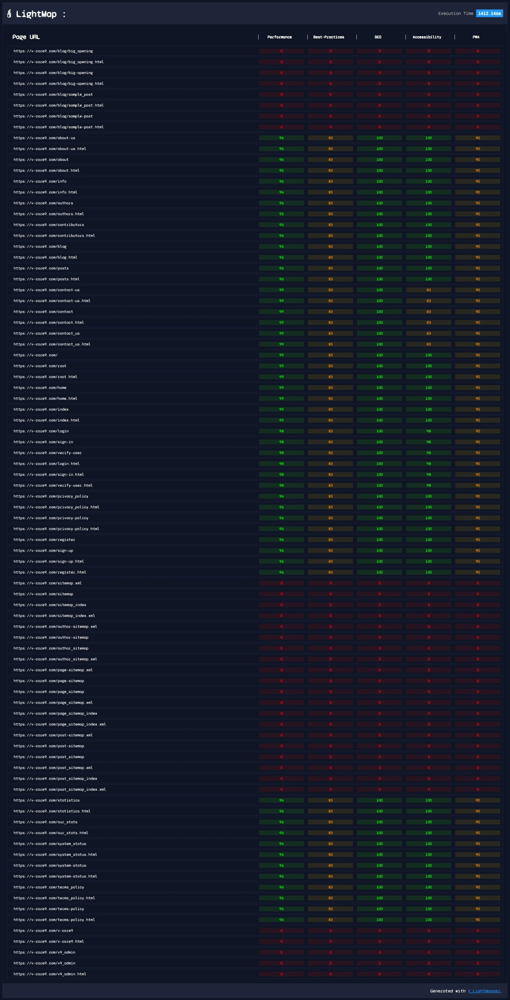

# **⚡** V_LightMapper  

V_LightMapper tool comes from combining Lighthouse webpage test tool from Google with Sitemapper package. By doing so we can scan whole website for performance metrics and generate HTML reports... this should allow for easier bug/performance issues detecting and preventing.  

---

## **[🚀]** How to install and use?  


> Command To Run :  
>
>       npm install v_lightmapper --save

---

## **[🔧]** How to **Config** [file] ?

This only requires config file set so it can start scanning sitemap.
Config File Expected Location.

FileName: ```lighthmapper.cfg.js```
Location:
```[+]📂 <root>/```
```:|:=> 📄 lightmapper.cfg.js```

---

## **[📑]** **lightmapper.cfg.js** file content?

This file should be quite simple to setup. Just put it into module export and use protocol, host & path.

```javascript
module.exports = {
  protocol: "https",
  host: "v-core9.com",
  path: "sitemap_index.xml",
  disableHeadlessMode: false,
  onlyCategories: ["performance"]
};
```

### 📌 Settings

- [ ```protocol``` ] => "http" OR "https"
- [ ```host``` ]  => "v-core9.com" OR "random_host_value" OR "localhost:8080"
- [ ```path``` ]  => This is relative path to sitemap file without protocol & host those get combined later.
  
- [ ```disableHeadlessMode``` ]  =>  ```true``` || ```false```    :: This is how you can tell chrome not to use headless mode.
- [ ```onlyCategories``` ]  => [ ```'accessibility'```,```'best-practices'```,```'performance'```,```'pwa'```,```'seo'``` ]  ::  This is an array of categories to test.

---

## [🔥] How to start it?

Well after your have installed all dependencies and configured **lightmapper.cfg.js** file with settings you want to user just run a command from ```package.json``` to run the tool.

    npm run map

That is it basically 🎉.

Now you just wait for it to finish and check the folder "results" for the generated HTML results.

---
## [🚗] Results ? 
Still quite basic, there is also results folder which it will use to store "per-page" html results. Will be connected soon to allow access by clicking in root results.




> For Additional Info/Help refer to >>>
>
> 👨‍💻 Author: Slavko V.  
> 📮 Email: slavko.vuletic92@gmail.com
> ⏳ Date: 2nd November 2021.
>
---  
